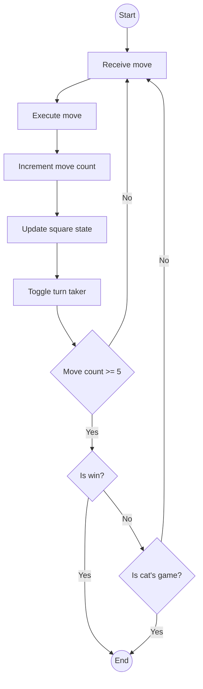

# bit-tac-toe

A simple tic-tac-toe game built around a 32-bit state.

> [!NOTE]
> Created as a submission for [CS Primer Tic-tac-toe problem](https://csprimer.com/watch/tic-tac-toe)

1. [Engine](#engine)
2. [Solver](#solver)
3. [Clients](#clients)

## Engine

The engine is where the main logic of the game is written. All clients and bots must only interact with the game through the engine's interface.

### Memory structure

The game state can fit in any 4-byte value such as an unsigned integer in C[^1].

[^1]: Generally speaking but not true for all architectures

```txt
31             24  22      18                                   0
+-+-+-+-+-+-+-+-+-+-+-+-+-+-+-+-+-+-+-+-+-+-+-+-+-+-+-+-+-+-+-+-+
|0|0|0|0|0|0|0|0|0|0|0|0|0|0|0|0|0|0|0|0|0|0|0|0|0|0|0|0|0|0|0|0|
+-+-+-+-+-+-+-+-+-+-+-+-+-+-+-+-+-+-+-+-+-+-+-+-+-+-+-+-+-+-+-+-+
\______________/\_/_/\______/\__________________________________/
 grave markers   ^ ^   count              game board
                 | |
                 | |_ player's choice
                 |_ current turn
```

| Offset | Size | Purpose                            |
| ------ | ---- | ---------------------------------- |
| 0      | 18   | [Game board](#game-board)          |
| 18     | 4    | [Game move counter](#move-count)   |
| 22     | 1    | [Player's choice](#players-choice) |
| 23     | 1    | [Current turn](#current-turn)      |
| 24     | 8    | [Grave markers](#grave-markers)    |

#### Game board

Here is an example of a game board with each square makred with a number:

```txt
+---------+---------+---------+
|  \   /  |         |         |
|   \ /   |         |         |
|   / \   |         |         |
6---------7---------8---------+
|         |   ---   |         |
|         |  |   |  |         |
|         |   ---   |         |
3---------4---------5---------+
|         |         |         |
|         |         |         |
|         |         |         |
0---------1---------2---------+
```

The same game board can also be viewed as a flattened array:

```txt
+---------+---------+---------+---------+---------+---------+---------+---------+---------+
|         |         |  \   /  |         |   ---   |         |         |         |         |
|         |         |   \ /   |         |  |   |  |         |         |         |         |
|         |         |   / \   |         |   ---   |         |         |         |         |
+---------+---------+---------+---------+---------+---------+---------+---------+---------+
     8         7         6         5         4         3         2         1         0
```

Each square on the game board can only be in exactly one three states:

- Occupied by `X`
- Occupied by `O`
- Empty

To represent tristate logic with bits we need two bits. For this scheme, we use a pair of bits to represent the possible states by using the most significant bit (MSB) as a signal that the square is occupied and the least significant bit (LSB) to indicate by which side it is occupied. If the MSB is not flipped on then the square is considered emtpy regardless of the position of the LSB. The states are represented as follows:

| State           | Binary | Hex   |
| --------------- | ------ | ----- |
| Occupied by `X` | `11`   | `0x3` |
| Occupied by `O` | `10`   | `0x2` |
| Empty           | `00`   | `0x0` |

With nine total squares on the board and each square being comprosed of two bits, the game board takes up 18 bits of the state. The squares are ordered from LSB to MSB with the two most significant bits representing square 8 and the two least significant bits representing square 0.

#### Move count

Game move count is stored as four bits to represent all possible integers from 0-15 (though only 0-9 are used). In addition to keeping a basic metric of turns taken, the count also allows us to defer checking for wins since no player can technically win a game prior to the fifth move.

#### Player's choice

The player is allowed to choose any side, either `X` or `O`. To keep track of this choice, a single bit is used with the on position representing the player's choice to play as `X` and the off position representing the player's choice to play as `O`.

The opposing side will be controlled by a basic AI.

#### Current turn

To keep track of whose turn it currently is a single bit is used. If the bit is in the on position then the current move must be taken by `X` and if the bit is in the off position then the current move must be taken by `O`.

#### Grave markers

Along with deferring win checking with the [move counter](#move-count) to reduce some of the computational overhead, grave markers are also used to keep track of which winning square combinations are no longer available. A combination is no longer available to win by if both an `X` and `O` are present within the squares.

### Game play

The game play loop can be represented by the following flow chart:



### Winning square combinations

Below is a table of possible square combinations that result in a win:

| ID  | Combination |
| --- | ----------- |
| 1   | {0, 1, 2}   |
| 2   | {3, 4, 5}   |
| 3   | {6, 7, 8}   |
| 4   | {0, 3, 6}   |
| 5   | {1, 4, 7}   |
| 6   | {2, 5, 8}   |
| 7   | {0, 4, 8}   |
| 8   | {6, 4, 2}   |

### Formal representation

The engine is just a simple state machine with the following definition:

#### 1. States ($S$)

All possible configurations of the game board state are valid states.

#### 2. Alphabet ($\Sigma$)

A token $a \in \Sigma$ is a 5-bit vector $a = a_4a_3a_2a_1a_0$ where:

- $a_4$ is the MSB representing the turn taking side (`1` for `X`, `0`, for `O`)
- $a_3a_2a_1a_0$ is the 4-bit number representing the square on the board with values greater than 8 being ignored

#### 3. Transition Function ($\delta$)

$\delta: S \times \Sigma \rightarrow S$ where:

- If the current input token is invalid then no state change occurs
- If the current input token is valid then the board is updated and the turn is passed to the next player

#### 4. Initial State ($s_0$)

The initial state is an empty board, empty counter, empty player choice, empty current turn, and empty grave markers (refer above).

#### 5. Accepting States ($F$)

The accepting states are any states that represent a win for `X`, a win for `0`, or where all grave markers are flipped on (resulting in a cat's game).

## Solver

[TODO]

## Clients

[TODO]
